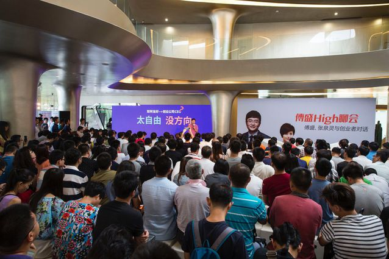
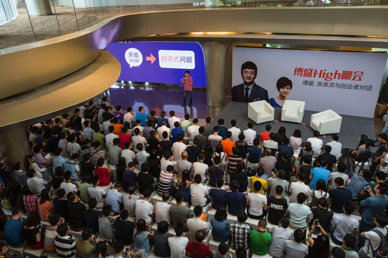

傅盛：怎样做一个创业公司CEO？
================================

> 傅盛High聊会，泉灵姐姐给的命题作文。怎样做一个创业公司CEO，核心还是思维模式。

这次傅盛High聊会，泉灵姐姐给我的命题作文。创业要如何开始，本质还是思维模式。首先学会把一个开放式问题转变为封闭式问题。不断试错，小步快跑，获取经验值。用外在重构内在，建立对世界的认知。演讲中举了很多例子。略长。欢迎大家在微信公众号（fstalk）与我讨论。

以下为部分演讲实录：

傅盛：首先感谢大家！不少远道而来的朋友。两个多月前，我跟泉灵讨论什么是互联网，后来我说，我搞了一个小项目，叫傅盛战队。如果有机会，从你的视角看一下什么是互联网。这次演讲题目也是她起的，叫《如何当好一个创业公司CEO》或叫如何创业。

这个问题非常难。我想了很久。因为我也在不断创业的过程中，不停说服自己，创业究竟有什么感受？

我见过可能做成一点点成绩的人。统一感受就是这件事太难！就像从死人堆里爬出来。**_有时候，你的赢，是不是真和你有关，连自己都不是很确信。_**

有一次，我接受采访，我说如果要我穿越过去，说“傅盛你再来一遍吧”。金山网络、猎豹这件事，我觉得我可能就不干了。因为实在太难了！这种难，难到什么程度呢？它难到，不可控性远远大于你自己的认知。

创业最大的难度就是太自由、没方向
----------------------------------------

我记得，刚从奇虎360出来时，给自己总结两句，“天高任鸟飞，海空凭鱼跃”。每天看着一个新奇的世界，充满好奇心，过一段时间，变得迷茫。天太高，海太蓝，每天面临无数多选择。

天天看着人家起来，每天都在想，我的想法是不是有问题，是不是有可能做不到。后来终于总结出来，创业最大的难度就是太自由了，自由到你很容易失去方向。

当时，网上有一个帖子，经常说，中国人从造原子弹到氢弹，只花了几年时间，比美国人、苏联人都快，但他说，其实第一个造原子弹和后面再造出原子弹，难度是不一样的。天上和地下的差距。

因为没有做出原子弹时，这件事能不能做成是不知道的。你没有这条路径。当别人做出来后，你再重新造一颗。你知道，它可达。你把范围集聚缩小了，变成了工程性问题。而开始，只是探索性问题。两个问题的难度，截然不同。

我从奇虎出来，第一次见到雷军，他问我一个问题，“360是怎样做成的？”我说，带了四个人，做了上亿用户，公司名字都是我起的。其实我连公司例会都不参加。因为太小。没人让我参加。我离开时，360在PC端全中国占有率已超过50%。

接着，雷军继续问了我一个问题，“在这件事情上，你的功劳大？还是周鸿祎功劳大？”我当时脑子转了一下，我想，他为什么问这个问题。后来我说，周鸿祎功劳大。

从没有广告到每天一百万下载，做到全中国50%占有。说实话，当时出走，我内心多少有点负气。但，随着时间的流逝，经验的积累，我慢慢发现，自己的答案是对的。

坦率地讲，安全这个方向不是我想的。当时我认为，安全不可能做赢。当然，也没有人认为可能做赢。瑞星、金山，几百人团队。我们是几个人。

当时公司说，你先做一款口碑软件再说。尽管，方向没有那么居功至伟的前瞻性，但给了你一个封闭式问题。就做一款免费安全软件。在这个封闭式问题下，做的所有努力，已经把难度极具降低。

没有方向时，你觉得都是方向。来回探索，大量时间被消耗。但给你一个固定性问题，叫封闭式、有区间问题。难度其实大幅度下降。虽然想出了，很多产品点子，但一个选择的重要性，其实远远大于过后做出的很多努力。

这是我对那个问题的思考。他给了我一个收敛性问题。在这个收敛性问题下，又给你提供人力、财务、公司构架。虽然没有推广费用，但不需要担心人员工资，不需要担心很多让你游离于产品之外的事情。只需安安心心做产品经理。正好机会来了，它变得很大。

后来，我越来越觉得，把一个问题变收敛，是很困难的一种状态。最近我在读一本书，叫《爱因斯坦传》。虽然那是个物理学的盛世时代，但爱因斯坦为什么能在那么多人情况下脱颖而出呢？

其中一个描述让我印象深刻。爱因斯坦很年轻就在想象一个场景。跟着一束光旅行会看到什么？由这个场景不断在大脑里思考。逆向化思考。把物理学上极其开放的探索，变成非常收敛的、具体化的形象，思考出了相对论。

还有一个场景。从下降的电梯里，会感受到什么？我突然发现，把一个开放式的问题，变成一个封闭式场景思考，可以使一个人的思维能力有巨大提升。

我想说的是，我们在创业过程中，可能最难的就是把自由度变成一个具体问题，变成一个具体目标。因为，我们在创业的时候，总是信心满满的认为，我要改变世界，我要成为最牛的人，我要做最好的自己。

我也一直用这种方式激励自己。一直到2010年，最困难的时候，当时在珠海，被对手强烈打压。产品和内部整合上，遇到很多问题。我才有了新的思考。

有一个记者去珠海采访我。问，你想把金山网络做成怎样的公司？我说要全力以赴的做成一家超牛逼的公司。他说这个不够。他说你知道吗？他举了对手的例子。比如那个人。看着他天天打这个打那个，但他一直想成为这个行业前几名，甚至大佬。他会全力以赴，把一个问题，一个方向，变成一个目标。

听了这句话以后，我突然意识到，自己以前很多思考，是错误的。**_因为，以前都在想，如何做最好自己，如何变牛逼，看上去有目标，却把“状态”误认为“目标”，甚至觉得自己做的都是对的。_**

我经常问团队，这件事为什么没做好？他说我已经全力以赴，我很努力，每天都在认真工作。我说这些都不是可以被证明的过程。你误把自己开放式的心理和工作状态，当成了工作和前进的目标。

降低创业难度：把一个开放式转变为封闭式问题
----------------------------------------

什么是封闭式问题呢？

后来，我开始思考。金山网络，要成为全球最优秀的互联网公司。我发现不够。我又开始思考。我说要变成国际化的公司。还是不够。我说要变成中国公司里移动端国际化最好的公司。仍然不够。最后变成一个封闭式的问题，说起来没那么有情怀。我说，成为国际上移动端的360。

由这个问题开始，我想到，找出CleanMaster的突破点。把CleanMaster变成一个封闭式问题。测算全球6亿覆盖用户，每天想想，我们怎么能做到。最近，我把这个问题又变成了一个更具像的问题。在全球移动互联网公司里，变成全球TOP3移动广告平台。

当然，这没有工匠精神，好奇心改变世界，听起来那么有情怀。这是个封闭式目标。但当你在一个封闭式目标下去做用户获取，做大数据分析，做到广告信息有效分发等等。一下变得清晰很多。

CEO核心是树立一个简单可行的目标
----------------------------------------

回到如何做好一个创业公司CEO。**_我认为，最核心问题，就是能把创业情怀变成具体问题。这个问题越具体越好。_**

例子有很多。昨天我看一则新闻。滴滴开了顺风车，一天有80万订单。一代更比一代强。滴滴提出了一个封闭式的口号，做最好的打车软件。最近叫车，5分钟内搞定。这就是非常封闭的问题。朝着这个目标努力，无论开顺风车，还是更多快车，能不能做到5分钟叫到一辆车？这个问题开始简单化了。

**_人和人之间最大的界限就是思维模式。思维模式看起来很简单，但你要突破这层窗户纸，难度比你想象还大。_**我一直在内部跟团队说，近几年，我可能是观察雷军最近的人。

但我还是要问大家，45岁雷军的精力旺盛，还是25岁雷军的精力旺盛？我相信自然规律，一定25岁。再问，十几年前，金山软件在整个行业里的技术、人才优势大？还是今天小米的人才、技术优势大？为什么金山和小米，今天差距如此之大？

这个问题我跟雷总探讨过很多回。问题在于，金山当年看到什么是机会就做什么。他一直没把这个问题收敛起来。全力以赴，每个领域都做。做最好的自己，最好的公司，民族软件的旗帜。大量的资源，消耗在不同战线。

小米成立时，我认为雷总把这个问题想的非常深刻了。一年卖一亿台手机就是伟大公司。当然，还有很多互联网精神。今天不谈情怀。忽悠创业者最大的问题就是情怀。如果有情怀，工匠精神，就能改变世界。如果创业这么简单，所有人都可以上艺术学院接受两年培训，全是优秀的创业者了。

但，创业不是这样。为了包装，让自己更快传播出去，被更多人认知，被很多没有创业的人崇敬，好像蛮是羡慕的眼神，这样可以。一旦回归到创业基本点，就不要轻则谈生态，动则谈改变世界，梦想这些东西了。这只是前进的内在动力。

**_创业，要像做一道数学题一样。_**

京东上有一款体重秤，叫云麦好轻。以前猎豹一个同事做的。现在几乎销量第一。当时做到一个月六千台时，他找我讨教。他说傅总接下来怎么做，智能硬件好火，大家都在健身，我也在做社区，要把这个链条做起来。

我说别扯了。我说你把创业变成非常简单的问题。体重秤一年多少出货。你能不能拿下一半市场。今天六千台，什么时候能够做到十万台。没有做到前，全力以赴做。用价格、用设计、用所有东西，12个月之内看能不能做到？如果能够做到，6个月能不能做到？6个月能做到，需要哪些资源，能不能像一道数学题那样列在那里？

**_想清楚目标，然后立刻做。_**

我问，做到六千台，为什么做不上去。他说，当时有一个配件出问题，生产没跟上。我说为什么不是多条生产线？为什么不是每个配件上都有这种能力？反向推演问题，创业的目标感就会变得极清晰。

路上，我跟泉灵姐姐也讨论这个问题。她说，其实跟她的成长路径是一样的。高人总是高人一筹。最初想做最好的主持人，后来发现怎么是最好呢？你觉得最好，人家不觉得最好。她开始把问题一个一个变成封闭式的。比如对着镜子说话和对着人说话是一样的。花几个月时间在自己内心做一个衡量。比如说一段两分钟的话，不看表，标准的两分钟，正负不差5秒钟。她说变成这样的问题之后，就会使你的整个事情开始变简单，否则你就是茫茫行舟。

关于这种思考模式，我跟很多同事包括创业者聊过。很多时候，我们都会没有这样一种思维模式。雷总每次跟我交流，他很喜欢做一道算术题。那时候的雷军比现在要有精力，要旺盛的多，就是因为思维模式的差异。雷总做小米时，思维模式上了一级。

一年一亿台。五年前，他就冲着这个封闭式目标一步一步走。当时三星和苹果大概快到一亿。那么，中国有没有可能出一家一年卖一亿台手机的厂商呢？如果做到，对手机厂商产生怎样的影响？如果做到了，对电商产生怎样的影响？

**_反复就一个封闭式问题，来回推演。一旦具备这样的能力，创业就开始变得简单。_**虽然它不再像当初那么壮怀激烈，那么有情怀，但它开始变得有解。

**_有解是最难的一件事情。_**

所以，CEO的核心是树立一个简单可行的目标。树立一个越简单越聚焦的目标，越好。尽管这个目标，可能在过程中，不断变化。阿里巴巴的口号是“让天下没有难做的生意”，但我觉得，他的封闭式问题是什么时候销售能够超过沃尔玛。以及怎么超过沃尔玛，用怎样的方式超过沃尔玛。

有一个词叫迎刃而解。我一直在思考刃在哪里？当猎豹想清楚要做国际化移动版免费安全软件时，变成全球超过6亿月度活跃用户时，变成全球TOP级别广告平台时，这个问题比“做最好的自己”、“全力以赴”要简单得多。

今天，我开始慢慢体会到，**_那种你想清楚一个问题，执行就开始变得简单的过程，而不是一种强烈依赖于强大的执行的状态。_**

**_创业过程中，开放式变成封闭式问题的转换能力，是我们真正最需要的能力的核心。_**

目标第一个特征：简单
-------------------------

互联网时代，简单是非常重要的目标。

当你的创业用一句话讲不清楚的时候，我觉得这个创业可能就开始出现问题。我现在就用简单这套法则，无往不破。每次大家讨论业务目标时，只要说太多，我就说，你已经违反简单原则。他说这个问题就是很复杂，我说你的问题会比中国更复杂吗？中国的事情，邓小平同志就用了三个字——GDP，或者转换为一句名言，“发展才是硬道理”。

你的复杂度不会超过一个国家。当你的业务这么复杂时，说明你的目标有问题。**_一定要用简单化思维确立目标，让目标足够简单。_**

如同我跟做体重秤朋友说的。一个月变成十万台，这个问题就结了。等每个月有十万台，甚至更多出货量时，一年有几百万纯硬件用户，并且激活App时，社区问题不也解决了吗？是不是有可能改造整个健身行业或者减肥行业？

如果只有几千台，怎么谈所谓的生态链。做成极简的时候，你再想那些延展的事。你的资源是有限的。一句话说清楚，整个公司看得懂，所有人不需要重复沟通，就知道需要干什么。

猎豹上市时，投资人不断问CleanMaster有什么？我说最简单的方式就是从GooglePlay把所有软件下载下来，先清理一遍，再用CleanMaster清理，还能清出很多垃圾，甚至清理出1倍。

为了这个简单的目标，我们做了整个自动化分析。把反病毒那套技术全用上。但对用户来说特别简单。所有清理软件都用了，用CleanMaster还能清理出垃圾，还能让手机更快。

这个简单的目标，能简单到什么程度呢？举个例子。我碰到罗振宇，我说，每次我听你说关注我们公众号罗辑思维，记住我，是没有走字的罗，我就想笑。我想了半天，什么叫走字，我说为什么不就是那个逻辑思维呢？他说当年装嘛，觉得自己名字在里边多好啊。

在我不停追问下，他有一天说，这是当时巨大的错误。每天花十秒钟解释没有走字的罗，这是资源巨大浪费，消费者精力的巨大透支，自己吃饱撑的没事干。移动互联网时代，一个排行榜上来，20个名字，名字不够吸引人，就损失至少百分之七八十的用户。

**_简单很重要。_**

我们都是被工业化时代培养出来的复杂的人。简单在我们身上是完全没有的。只有90后、甚至00后才会简单。他们没有经历我们的培训。没有看到一个复杂的鼠标三个键、五个键，还有滚轮。Photoshop等等最难的软件，上培训课，才会用。这种复杂从骨子里来的。**_如果不下意识对抗，我们会把复杂，认为是美，是优势，是自己不可比拟的无与伦比的特质。_**

另一个例子。国内某款手机出来时，强调美，用了一个对称设计，左边三个键，右边三个键。我说，这个设计最大的问题，就是摸上去不知道在左还是右。经常会想想，左边是音量，还是右边是音量。你们不要觉得，我是吹毛求疵。很多用户真的不知道什么时候按左，什么时候按右。

**_目标足够简单，你就开始聚焦。_**无论任何时候，资源都是极其有限的。如果你想出三个目标，就如同有一个人跟我说，这件事要做三步，我就想为什么不是一件事。对方总会说，不行，环环相扣的。如果环环相扣，是不是思维逻辑出问题了？

**_没有找到简单的点，才会让我们失去聚焦。_**当你要做一件事，能够把这件事需要的所有组件，就地调过来，去掉所有头衔，在一个组里，几个月时间，冲出一款软件，一出来口碑就极好。如果没有把聚焦点坚持下去，看上去处处开花，其实没有一个点是核心命脉。

目标第二个特征是聚焦
------------------------

我对布局这种词特别反感。我从来不认为，哪个局是布出来的。**_我认为，聚焦一个点来回横切，形成一个足够高的局部高地，从这个高地上顺势俯冲，一举而成。而不是靠撒网一样，放出很多点，来做到的。_**

很多人说猎豹发展好快，居然上市了，几十亿美金了。他们的潜台词就是，你们怎么没有像瑞星一样消失掉，或者你们怎么能上市，海外怎么能做出来呢？

我说，我们只是抓住了一个看上去极其微小的核心机会。那个微小的点，小到你根本就会忽略它。当哈尔滨同学做的一个小软件，在美国排行榜前三的时候，我意识到这是个大机会。把全公司资源投入进去，做了一款极简单的清理软件。

从第一版到现在，按纽没有增加，一直四个按钮。当4个人，2个月，准备做第5个按钮，我说不准做。上来就一个按纽，直接点就完了。为什么四个按钮。就是极简单的点上聚焦。聚焦到别人都没办法在资源上拼过我。

目标的第三个特征是被验证
-------------------------

“被验证”非常重要。重要到什么程度？重要到你都应该忘掉自己是谁。我们总在内心觉得，自己很专业，我才了解用户。其实互联网本质就是一个不断试错的过程。

你一定要用数据，验证这件事情可行，你才真的认为它可行。如果你不能认为它可行，如果你自己内心坚持认为它可行，但它在验证这个点上，不被通过。

一定要放弃自己的想法。也许你会错失成为乔布斯的机会，但你有更多机会把这件事做成。

我问过创业者很多问题。创业者一般最喜欢说，我比他们专业。我说，这个假设是错的。他们说，不会，我就比他们专业。我说，第一，如果你的对手是大公司，就算他个人不比你专业，他的团队一定比你专业。大公司理论上能雇到最好的人。第二，这个世界变化太快，有的时候这个世界已经变化了，你都不知道它变化了。我们怎么理解这个世界？

当雷军的《Areyouok》成为KTV点唱前三名的时候，这个世界怎么认知？没法理解这种文化。爬山时，一个小同事一直唱这首歌，我都快会哼了。这是怎样的一个世界？这个世界的变化速度，其实是巨大的弯道。所有东西都在崩塌。

我们必须依靠靠验证。**_要用外在的事实，来证明自己。不要用内心的固执去证明。遇到问题，一定要快速转向。_**

**_怎么转向呢？小步快跑。_**

讲到小步快跑。我想到一个例子。前两天，跟直播神州发射的泉灵姐姐在硅谷看了一个创业团队。那个团队干什么的呢？做火箭。要把火箭做到只花100万美金就能发射。中国火箭发射一次5000万美金。他要用100万美金，发射小型卫星火箭。

我的第一个问题是多少人？他说4个人。我说怎么做到？他说，用3D打印，打印出火箭的发动机。传统火箭发动机的设计，加点火，再加试验，需要6个月以上的周期。但我只需两个礼拜。因为设计费用太高。都是很强的材质。他说，我用普通材质。用3D打印机,打印材料,快速实践，改善设计，就有可能利用普通材质，做成火箭发动机。

我当时感慨，这个时代真是不断试错的时代。通过不断尝试，调整目标，把目标用互联网方法，逐渐清晰化。

侦察兵模式，不断试错，寻找目标
------------------------------

目标的最初寻找，我总结叫侦察兵模式。这个时代不再是生产制造时代。不再是有了技术优势、生产线优势、资金优势，就有可能被颠覆的时代。要通过不断尝试，不断试错，获取更多经验值，从而变得比别人更强大的时代。

小步快跑，不仅是互联网法则，更是整个人类社会进步的法则。过去缺乏小步快跑的基础，因为生产成本太高。今天，不断快速尝试，能够找到自己的目标，并实验出结果。**_试错的本质是在增加经验值。_**

创业就是一个不停打怪，获取经验，不断升级，等有子弹，再打BOSS，然后上市。如果每天都在研究琢磨，从不试错，就会被怪打死。

侦察兵的核心是获取经验值，建立对世界的认知
------------------------------

互联网，让你在短时间内，获取比别人更多的经验值。经验值用来干什么？用来建立你对世界的认知。通过外在，不断重构内在。千万不要盲目相信自己。相信自己是你创业最大的动力。但你在做产品，做目标的时候，要学会用外在改变内在。

什么叫外在？就是眼见为实。你看到的事情才是真的。不是你以为的事情是真的。我们经常会陷入到一个极其错误的逻辑中。我已经都了解了，这个事一定能干，我们就这么干。6个月、12个月，为什么没做到呢？投资人没给我钱，对手老抄我，基本不会认为是自己当时选错方向。事实可能就是你的错。最大错误就是，没用外在世界来改变自己。

尤其作为产品经理，更需要用侦察兵模式，获取很多经验值，重新树立判断。这方面我有非常多教训。当时，我们的产品经理跟我说，要做天气。我说天气有什么好做的？有什么值得做的？当我看数据，百度移动搜索一半词汇来自于天气。于是我在所有产品上，加了天气提示。

为什么？因为突然发现我不对。我出门就有车，从来不关心天气，必须很羞愧的承认这点。事实上太多人关心天气了。当我发现这件事这么重要时，花了很大精力在全球做天气。

这个世界变化太快，新东西层出不穷。我们怎么改变自己内心固有的东西。我们当时在做CleanMaster，很多程序员不愿意，为什么？他们说做安全，怎么做清理呢。我说对。但GooglePlay上面搜索Clean这个词是Security的2到3倍。面对这个惨淡的事实，移动端安全需求没有起来，用户不需要太强烈的安全。

但用户需要清理。特别安卓手机，经常卡、慢、发热。所以，不能因为你认为安全重要，安全就重要。你认为清理不重要，清理就不重要。从今天的数据看，清理是可以改变世界的。

我们做的小功能叫Applock，为什么单独对App做Lock呢？我还是没有想清楚这个东西会有那么大需求吗？后来他们说,印度有一款这样的需求，排行榜前几。我说那赶快做。印度人的手机是互相交换的。特别需要。做了以后，每天有几亿用户使用。

如果你不觉得有这个需求，怎么办？学会通过用数据不断重构。有一次我跟口袋购物王珂聊。他们为了找到这样的机会，做了一个海豹突击队。一个礼拜时间上线，然后看数据，数据只要好就上，不好就放弃。放弃一个，再来一个。没有人在快速变化中是所谓的大牛。

再比如微信。总共出现四五年。哪有很多经验。不停试，快速做。拿到经验值。发现一个点，直接切进去。

**_我特别想强调这点。我们自己都会犯经验主义错误。为什么要重构？因为整个世界都在重构。你要用外在的东西，改变对这个世界的认知，否则你就会停留在用过去经验判断未来。_**

傅盛战队有一个项目叫Musical.ly。前几天美国Applestore排行榜第一。我问创始人，为什么选择这个产品？他说当时做一个产品时候一天几十个下载，几百个登陆，他们就换了。做这个。一天两百个下载，比那个产品多很多倍。觉得这是个机会。开始做。前两天排名超过Facebook，单日几十万下载。

傅盛战队还有一个项目叫小余老师说。一档互联网教育类的逻辑思维。每期点击一百多万次。这是88年没有生孩子的年轻人。我跟泉灵姐姐说，这个产品多棒，全网教育类排名第一，没有推广。她打开一看，哇，布景怎么这么难看，灯光有问题，讲的声音让人有疲劳感。

我说，我们身边大把很强的人。你不能这么想。要从外在来看。已经到了这么大的量，说明有些地方切中了教育的核心。被证明了。

说了这么多。创业最容易犯的错误，既有强烈的信心，又能通过很多数据的事情，通过外在的世界，不断重构你的产品观。你可能会说乔布斯不是这么做的。谁做成工匠就牛了。有情怀就把产品做好了。反正至少我不是那种天才。我也不知道天才是不是真这么做产品。

总结如何创业：预测-破局点-Allin
----------------------------

我最近有一篇文章，关于战略三段论：预测-破局点-Allin。也可以总结为创业三部曲。

**_第一，预测的本质就是找到巨大的方向。_**这个方向怎么寻找？既有思考成分在，也有尝试成分在。当你发现一个产品快速成长。可能代表一个大的方向。

我们为什么敢做国际化？一个重要点，当时小团队做了清理大师，我个人觉得产品做的不错。然后我发现美国排行榜上，中国很多小软件排名靠前。我认为中国移动App全球化时代一定会来。中国移动App研发，会像过去几十年的日本汽车、韩国电器、台湾半导体，在全球占有统治地位。这就是我做的巨大预测。

这种预测值多少钱呢？我认为一家公司95%以上来自于你对这个大方向的判断和切入。傅盛战队选了很多项目，也许看起来每个创始人起步不是那么高大上。但选择的都是和传统行业结合比较多的。要么是教育，要么是医疗，要么是O2O。App的核心竞争其实基本已经开始结束了。

**_第二，寻找破局点。在大的方向上，不能用撒网的方式，要找到一个特别细小的点。_**你在一个看上去很边缘、很狭隘的领域做成行业第一，这个领域越窄，再窄都没关系。只要有机会变成行业第一，你就开始有了巨大的机会。

这个时代就是一个点改变世界。怎么寻找这个破局点？**_不断尝试和试错。用快速的尝试完成对这个世界的认知，找到用户的需求点，不停收集用户需求，重构心里的产品观。_**一旦找到这样一个产品，全力以赴去做。

**_有人会问，你又讲试错，又讲聚焦，这个平衡怎么找？最好的平衡就是它被验证。_**互联网是口碑时代。只要出现用户自增长，用户主动传播。出现这样的例子时，基本被证明就是破局点。你应该用这个行业内大家都没有想过的资源去投入。

我们当时做清理的时候，投200人进去，做一款小App。创业本质就是这样。想清楚大方向时，全力以赴的Allin。一定不要先前有收入、用户需要，就把战线拉太长。我们当时从珠海调几十人到北京，全开始干移动，不停寻找破局点。

今天很多创业者说做好这个事需要三件事。我只让你讲一件事，这件事是什么。如果没找到，要快速找到。找到这件事，你就开始具备Allin。

认知差距是互联网唯一的壁垒

**_互联网没有任何壁垒，除了认知之外，就是思维模式的差异。_**最开始都说互联网没什么了不起，就是一根破网线，传统行业觉得这个事情我也能做，纷纷进军的时候全失败了。

互联网对传统行业的冲击是摧枯拉朽。怎么说？你看出租车司机把出租车交给公司了。不交份钱了，直接加入滴滴、Uber，这就叫摧枯拉朽。这种认知一旦差别以后，就形成了时间的差距，你就变成了制高点，更多的资源迅速积累。

**_互联网极大降低信息传播成本。极短时间内，能有引爆效应，有了引爆效应以后，开始变成雪球模式。_**

一定要知道认知差别的力量有多可怕。这种可怕程度，就是让整个台湾和日本停留在上世纪。

有一次在日本见一家估值100多亿美金公司CEO。他像中学生一样。跟软银前副总裁吃饭，大概60多岁。他告诉年轻人，你在这里任何地方，都能买到很多东西，享受最便利的服务。年轻人回了一句，这也许正是日本互联网没有发展起来的原因。你们太成熟。成熟到思维不需要变革，也能享受很好的服务。

什么叫认知？就是无条件接受。你没有理由反驳。不必要反驳。除了证明你能反驳之外，你什么都证明不了。认知差距是互联网唯一的壁垒。

**_作为一个创业者来说，怎么调整自己的思维？_**

我总结一下。如果在自己的思维里，能够把开放式问题变成封闭式问题；在这个过程中，不断根据变化极快的世界重构自己；大方向上，抓住具体机会，然后全力以赴。

今天创业本质上，还是精英文化。成功率非常低。大家一定要有这样的认知。创业成功的人，不是因为他多聪明。而是因为他能够不断改变自己。跟这个时代紧紧相扣，每一步都踩得准，才有可能在这样疯狂激烈的竞争中，不断成长，不断成功。

> [原文连接](http://fusheng.baijia.baidu.com/article/112184)
